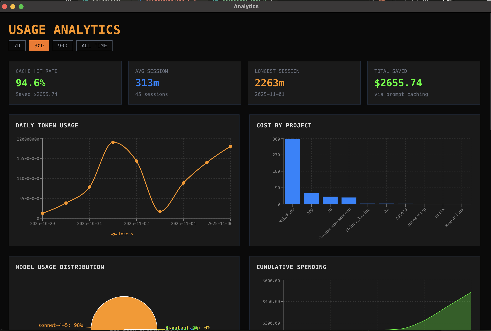
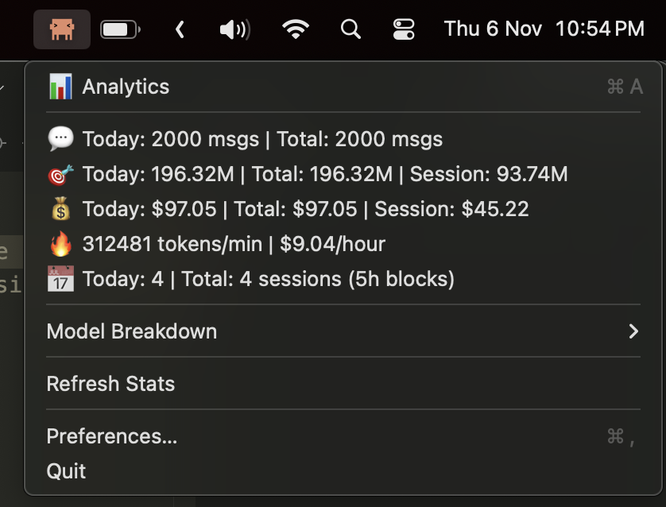

<div align="center">


# Claude Code Mac Menu

**A macOS menu bar application that enhances Claude Code with comprehensive usage analytics and real-time notifications**

[Download Latest Release](https://github.com/PiXeL16/claudecode-macmenu/releases/latest) • [View Documentation](./INSTALL.md) • [Report Issues](https://github.com/PiXeL16/claudecode-macmenu/issues)

</div>

## Screenshots

<div align="center">

### Analytics Dashboard


*Comprehensive analytics with 8 interactive charts showing usage patterns, costs, and trends*

### Menu Bar Stats


*Quick access to live statistics from the menu bar*

</div>

## Features

- **Comprehensive Analytics Dashboard**: Interactive charts and visualizations (Press `Cmd+A`)
  - Daily token usage and cost trends
  - Project-level cost breakdown
  - Model distribution and usage patterns
  - Hourly and weekly usage analysis
  - Cache hit rate and savings tracking
  - Session duration analytics
- **Real-Time Notifications**: Hook-based notifications using Claude Code events
  - Instant alerts when Claude finishes responding (Stop event)
  - Task agent completion notifications (SubagentStop event)
  - Tool-specific completion alerts (Bash, Task, etc.)
  - Event-driven, no polling required
- **Live Menu Bar Stats**: Quick access to key metrics
  - Token consumption (input, output, cache tokens)
  - Cost tracking with model-specific pricing
  - Burn rate (tokens/min, $/hour)
  - Session tracking (5-hour blocks)
  - Model usage breakdown
- **Cost Monitoring**: Track daily and total spending across all projects
- **Customizable Settings**: Dark terminal-style UI with preferences
- **Native macOS**: Lightweight menu bar app with Clauwd branding

## Analytics Tracked

**Messages**
- Today's message count
- Total messages
- New message detection for notifications

**Tokens**
- Daily and total token consumption
- Current session tokens
- Input/output/cache token breakdown
- Per-model token usage

**Costs**
- Daily costs
- Total costs
- Current session costs
- Real-time burn rate

**Sessions**
- 5-hour session blocks
- Daily and total session counts
- Active session monitoring

## Installation

### Option 1: Download from GitHub (Recommended)

**Latest Release:** [v0.2.0](https://github.com/PiXeL16/claudecode-macmenu/releases/tag/v0.2.0)

1. Download `Claude-Code-Menu-0.2.0-arm64.dmg` from [Releases](https://github.com/PiXeL16/claudecode-macmenu/releases/latest)
2. Open the DMG file
3. Drag "Claude Code Menu" to your Applications folder
4. Launch from Applications or Spotlight
5. On first launch, you may need to:
   - Right-click the app and select "Open" (macOS security)
   - Allow the app to send notifications
   - The app will prompt you to install Claude Code hooks

### Option 2: Via Homebrew (Coming Soon)

```bash
brew install --cask claudecode-macmenu
```

*Note: Homebrew cask formula is pending approval*

## Development

```bash
# Install dependencies
make install

# Run in development mode
make dev

# Build TypeScript
make build

# Package for distribution
make package

# Run tests
make test
```

## Release Process

### For Maintainers

**Quick releases:**
```bash
# Patch release (0.1.0 → 0.1.1)
make release-patch

# Minor release (0.1.0 → 0.2.0)
make release-minor
```

**Manual version:**
```bash
# Specify exact version
make release VERSION=1.0.0
```

**What happens during release:**
1. ✅ Updates version in `package.json`
2. ✅ Builds the application
3. ✅ Packages DMG and ZIP files
4. ✅ Creates git commit and tag
5. ✅ Pushes to GitHub
6. ✅ GitHub Actions creates release with artifacts
7. ✅ Update Homebrew cask manually or via PR

**GitHub Actions:**
- Automatically builds and creates releases when version tags are pushed
- Uploads DMG and ZIP to GitHub Releases
- Generates release notes automatically

**Homebrew Submission:**

To submit to Homebrew Cask:
1. Fork [Homebrew/homebrew-cask](https://github.com/Homebrew/homebrew-cask)
2. Create a new branch: `git checkout -b claude-code-menu`
3. Add the cask file from `homebrew/claudecode-macmenu.rb` to `Casks/c/claude-code-menu.rb`
4. Test the cask:
   ```bash
   brew audit --new --cask claude-code-menu
   brew style --fix claude-code-menu
   brew install --cask claude-code-menu
   brew uninstall --cask claude-code-menu
   ```
5. Commit with message: `claude-code-menu 0.2.0 (new cask)`
6. Push and open a PR to `Homebrew/homebrew-cask`

See [Homebrew docs](https://docs.brew.sh/Adding-Software-to-Homebrew) for details.

## Requirements

- macOS 10.13 or later
- Node.js 18 or later

## Quick Start

### For End Users

1. **Download** the latest release `.dmg` file
2. **Install** the app by dragging it to Applications
3. **Launch** the app - look for the icon in your menu bar
4. **Setup hooks** - The app will prompt you to install Claude Code hooks automatically
   - Click "Install Hooks" when prompted
   - Or go to Setup → Install Hooks from the menu

That's it! You'll now get real-time notifications when Claude Code completes tasks.

📖 **Detailed installation guide:** [INSTALL.md](./INSTALL.md)

### For Developers

```bash
# Clone and install
git clone https://github.com/PiXeL16/claudecode-macmenu.git
cd claudecode-macmenu
npm install

# Build and run
npm run build
npm run dev

# The app will prompt you to install hooks automatically
```

## Usage

### Analytics Dashboard (Cmd+A)

The comprehensive analytics dashboard provides deep insights into your Claude Code usage:

**Interactive Charts:**
- **Daily Token Usage**: Line chart showing token consumption over time
- **Cost by Project**: Bar chart of spending across different projects
- **Model Distribution**: Pie chart showing which models you use most
- **Cumulative Spending**: Area chart tracking total costs over time
- **Token Type Breakdown**: Pie chart of input/output/cache token distribution
- **Usage by Hour**: Bar chart showing when you're most active
- **Usage by Day**: Dual-axis chart of sessions and costs by weekday
- **Messages Per Day**: Line chart of daily message volume

**Summary Cards:**
- Cache hit rate and total savings
- Average and longest session durations
- Total sessions and productivity metrics

**Time Range Filters:** 7 days, 30 days, 90 days, or all time

### Menu Bar Features

Click the Clauwd menu bar icon to access:

**Live Statistics:**
- Messages (today and total)
- Tokens (today, total, and current session)
- Costs (daily, total, and session)
- Burn Rate (tokens/min, $/hour in real-time)
- Sessions (5-hour blocks, daily count)
- Model Breakdown (submenu with per-model stats)

**Quick Actions:**
- Analytics Dashboard (Cmd+A)
- Refresh Stats
- Preferences (Cmd+,)
  - Notification settings
  - Menu visibility options
  - Compact mode toggle
  - Auto-start configuration
- Quit

## How It Works

**Notifications (Hook-Based):**
- The app runs an HTTP server on `localhost:3456`
- Claude Code hooks send events to the server when tasks complete
- You get instant notifications without any polling or file watching
- See [HOOKS.md](./HOOKS.md) for customization

**Analytics (File-Based):**
- Reads Claude Code usage data from `~/.claude/projects/**/*.jsonl`
- Tracks tokens, costs, sessions, and model usage
- Auto-updates every 30 seconds
- Based on [Claude-Code-Usage-Monitor](https://github.com/Maciek-roboblog/Claude-Code-Usage-Monitor)

**Data Storage:**
- Settings: `~/Library/Application Support/claudecode-macmenu/settings.json`
- Hooks config: `~/.config/claude-code/hooks.json`
- Usage data: `~/.claude/projects/**/*.jsonl` (read-only)
